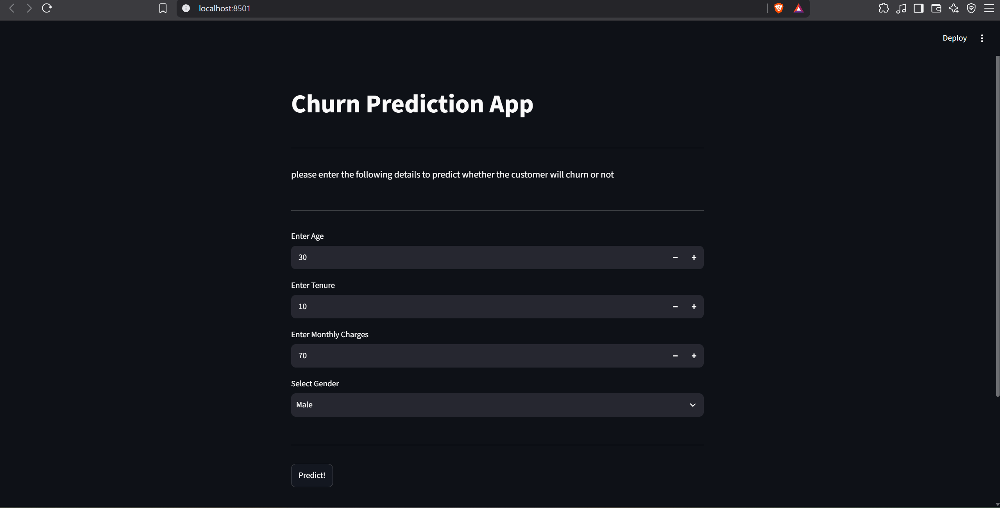

# Customer Churn Prediction

A machine learning web application that predicts whether a customer is likely to **churn or stay** based on customer information.

## Overview

This project uses a trained machine learning model to predict customer churn based on:

* Age
* Tenure
* Monthly Charges
* Gender

The trained model and scaler are integrated into an interactive **Streamlit** application for real-time predictions.

## Tech Stack

* Python
* Pandas
* NumPy
* Scikit-learn
* Joblib
* Streamlit

## Project Structure

```text
Customer-Churn-Prediction/
│
├── app.py
├── model.pkl
├── scaler.pkl
├── customer_churn_data.csv
├── notebook.ipynb
├── data.txt
├── requirements.txt
├── app_screenshot.png
└── README.md
```

## How It Works

1. Enter customer details in the Streamlit interface.
2. Gender is converted into a numerical value.
3. The input is arranged in the required feature order.
4. The saved scaler transforms the input.
5. The trained model generates the prediction.
6. The result is displayed as **Churn** or **Not Churn**.

## Model Features

| Feature         | Description              |
| --------------- | ------------------------ |
| Age             | Customer's age           |
| Tenure          | Customer's tenure        |
| Monthly Charges | Monthly customer charges |
| Gender          | Male/Female              |

Feature order:

```text
Age → Tenure → MonthlyCharges → Gender
```
## Model Performance

The trained model achieved the following results:

|Metric	      |Score         |
|--------------|------------- |
|Accuracy	    |85.50%        |
|Precision   	|88.48%        |
|Recall	      |96.02%        |
|F1 Score	    |92.10%        |

The high recall indicates that the model is effective at identifying customers who are likely to churn.


## Demo

### Streamlit Application



The application provides an interactive interface where users can enter customer details and receive an immediate churn prediction.

## Installation

Clone the repository:

```bash
git clone https://github.com/anshusaroha3435/Customer-Churn-Prediction.git
cd Customer-Churn-Prediction
```

Install dependencies:

```bash
pip install -r requirements.txt
```

## Run the Application

```bash
streamlit run app.py
```

The application will open in your browser.

## Files

* `app.py` — Streamlit application
* `model.pkl` — Trained ML model
* `scaler.pkl` — Feature scaler
* `customer_churn_data.csv` — Dataset
* `notebook.ipynb` — Model development and analysis
* `requirements.txt` — Project dependencies
* `app_screenshot.png` — Application screenshot

## Future Improvements

* Add prediction probability
* Improve model performance
* Compare multiple ML algorithms
* Add data visualizations
* Deploy the application online

## Author

**Anshu Saroha**

B.Tech Mechanical Engineering
Delhi Technological University
